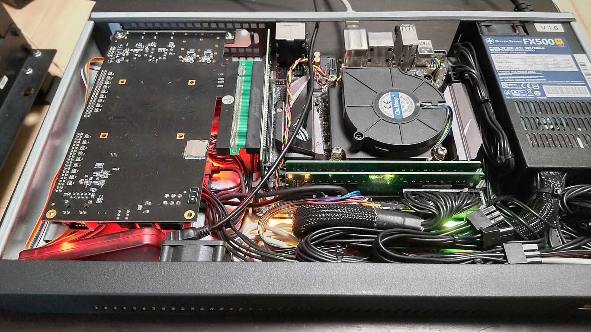

# nvme-pcie-to-fabrics-proxy

- [README (日本語)](./README.ja.md)

- note : this repository is under initial construction, not yet achieved target functionality. see roadmap section.



fig. 1: PCIe board with tutorial 1 ramdisk design installed on PC

list 1: Test result of ramdisk design

```
$ sudo nvme id-ctrl /dev/nvme0n1
NVME Identify Controller:
vid       : 0x10ee
ssvid     : 0x9028
sn        : 000000000000
mn        : FPGA-emulated RAMDISK
fr        : 0000
rab       : 1
ieee      : 9ca3ba
... snip ...
tnvmcap   : 1073741824
... snip ...

$ dd if=/dev/urandom of=input.img bs=4k count=16k
16384+0 records in
16384+0 records out
67108864 bytes (67 MB, 64 MiB) copied, 0.216841 s, 309 MB/s

$ sudo dd if=input.img of=/dev/nvme0n1 bs=4k count=16k
16384+0 records in
16384+0 records out
67108864 bytes (67 MB, 64 MiB) copied, 60.7511 s, 1.1 MB/s

$ sudo dd if=/dev/nvme0n1 of=output.img bs=4k count=16k
16384+0 records in
16384+0 records out
67108864 bytes (67 MB, 64 MiB) copied, 42.0484 s, 1.6 MB/s

$ diff -s input.img output.img
Files input.img and output.img are identical
```

## What is this ?

- Circuit and firmware design for FPGA based PCIe accelerator board with Ethernet port.
- Providing emulated NVMe SSD device to host PC that its read/write commands are relayed into specified NVMe/TCP target transparently, so you can make your PC network-booted transparently. (note : network function is not yet implemented)
- One typical proposal of "everyday use" of FPGA based board that usually assumed as "development use".
- Open-sourced and limit additinal cost except the accelerator board and writer cable themselves.
- Maintain tutorial project with limited function (e.g. NVMe RAMDISK without network connection) seperately for porting and educational use.

## Restriction

- Made with reference to the NVMe 1.3 standard, but compliance is not guaranteed.
- This is an experimental code and we are not responsible for any damages, data loss, etc. caused by using it.

## Roadmap

- 2023.02 : providing tutorial design step 1 enables "NVMe/PCIe RAMDISK (no connection with NVMe/TCP, software-based reference design)" for 2 Xilinx FPGA based boards
- tbd     : providing tutorial design step 2 enables access for software-based read and write to specified NVMe/TCP target
- tbd     : providing complete design (connects NVMe/TCP target with hardware-accelerated approach)

## Supported boards

| board name (identifier) | core FPGA model    | PCIe standard | Ethernet standard           | Programming Cable                         | development phase | note                                                        |
|-------------------------|--------------------|---------------|-----------------------------|-------------------------------------------|-------------------|-------------------------------------------------------------|
| Xilinx Alveo U50 (au50) | Virtex Ultrascale+ | gen3 x8       | 10GbE via QSFP+ 4x breakout | Alveo Programming Cable (sold seperately) | tutorial step 1   | Alveo Vivado Secure Site access needed (contact Xilinx FAE) |
| ALINX AX7A200 (ax7a200) | Artix-7 xc7a200t   | gen2 x2       | 1GbE via RJ-45              | AL321 Writer (kit included)               | tutorial step 1   |                                                             |

## Directory structure

```
├── LICENSE
├── README.md                : this file
├── README.ja.md             : README in Japanese
├── docs
├── tutorials
│   ├── 01_ramdisk           : tutorial step 1 design
│   │   ├── xilinx_2022.1    : type `$ make` here to xilinx toolkit 2022.1 environment get introduced on your shell
│   │   │   ├── Makefile
│   │   │   ├── README.md
│   │   │   ├── au50         : type `$ make` here to compile & get EEPROM configuration for Alveo U50 board
│   │   │   ├── ax7a200      : type `$ make` here to compile & get EEPROM configuration for AX7A200 board
│   │   │   └── docker
│   │   └── (intelfpga_)     : reserved
│   └── (02_lwip)            : reserved
└── (mainline)               : reserved
```

## Prerequisites

- supported FPGA PCIe accelerator board

- programming cable for the board

- compiler & configurator PC
  + x86\_64 based Linux host
  + RAM 16GB or more required (larger FPGA device needs greater RAM)
  + some hundreds of GBs storage space (heavily in /opt)
  + docker environment with non-priviledged user access
  + programming cable via USB should be accessible from non-priviledged user
    * some cables might behave as generic ftdi USB serial port so that you have to unbind ftdi\_sio driver before programming

- emulated NVMe device tester PC
  + modern architecture computer (x86-based, arm-based, and etc.) with PCIe support
  + popular OSs (Linux, Windows, and etc.) with NVMe driver
    * currently tested on only x86\_64 Linux host

## How to use

1. get FPGA compiler toolchain introduced on your PATH
  + select and cd to {development phase} directory (e.g. "01\_ramdisk" and future dir)
  + cd to {FPGA manufacturer}\_{toolchain version} directory (e.g. "xilinx\_2022.1")
  + type `$ make` to get the toolchain -suitable CLI shell via docker
    * you have to install the toolchain binaries on /opt at first time, the `install.sh` script on /root inside the docker image will help installing automatically.
  + (option) if you have already installed specific toolchain and their reference introduced on your PATH, skip this step.

2. compile & get EEPROM configuration files
  + cd to {supported board} directory (e.g. "au50")
    * note : alveo U50 accelerator requires au50 board definition files provided in Vivado Secure Site, see README file of ext\_resource
  + type `$ make` to run full-compilation flow and you'll see EEPROM configuration files on `output` directory (i.e. mcs files for xilinx FPGA)

3. write config file into EEPROM on board
  + open hardware manager of the tool chain and write config file via programming cable
  + see introduction on README placed on each directory 

4. install the board on tester PC and power on
  + typically you can see /dev/nvme0n1 on linux, can partition them with `gdisk`, and format them with `mkfs.ext4`.

note : for RAMDISK variant, you will lost all written data of /dev/nvme0n1 on power down

## References
- [NVM Express Base Specification](https://nvmexpress.org/developers/nvme-specification/)
  + [https://nvmexpress.org/wp-content/uploads/NVM-Express-1_3d-2019.03.20-Ratified.pdf](https://nvmexpress.org/wp-content/uploads/NVM-Express-1_3d-2019.03.20-Ratified.pdf)

